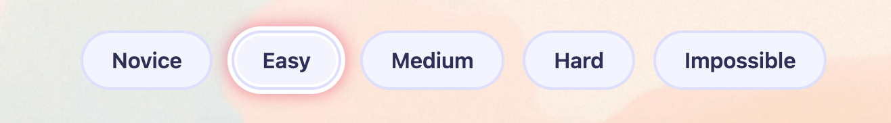
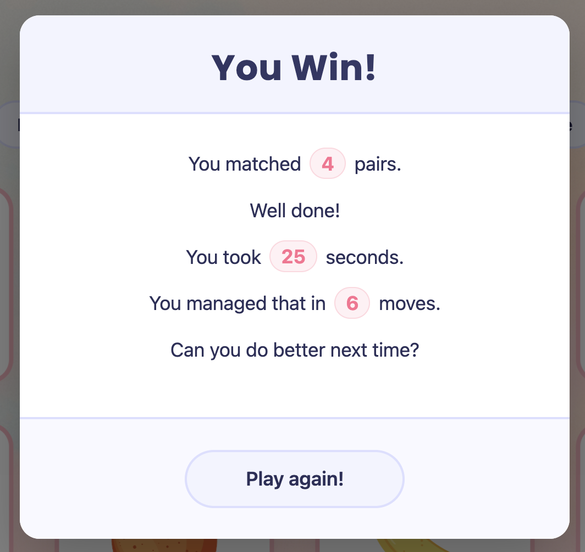
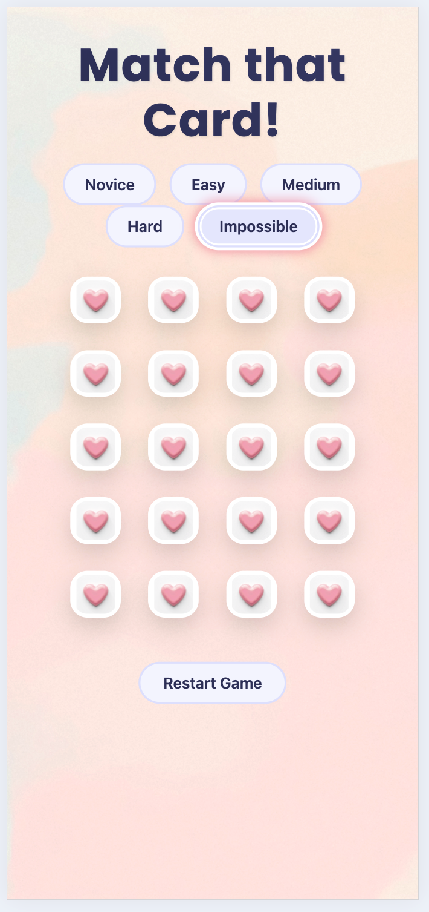
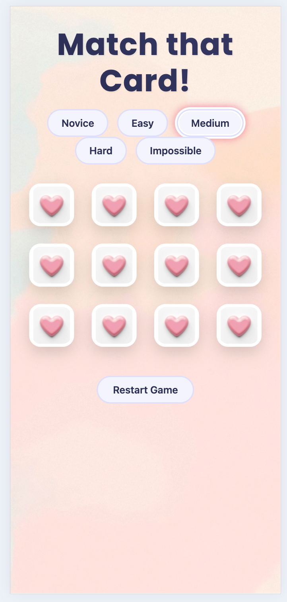
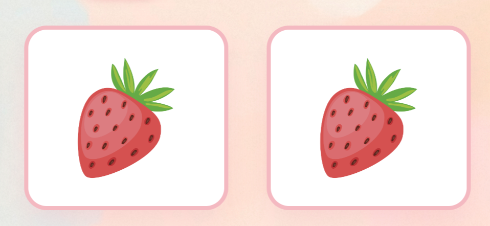

# 🃏 Match That Card! - Memory Matching Game

## Table of Contents

- [Overview](#overview)
- [Features](#features)
- [User Value](#user-value)
- [Screenshots & Demo](#screenshots--demo)
- [Deployment Procedure](#deployment-procedure)
- [UX Design Process](#ux-design-process)
- [External Code Attribution](#external-code-attribution)
- [AI-Assisted Development Reflection](#ai-assisted-development-reflection)
- [Contributors](#contributors)

## Overview

**Match That Card!** is an engaging, browser-based memory matching game built with HTML, CSS, and JavaScript. The game challenges players to find matching pairs of cards across five difficulty levels, from Novice (2 pairs) to Impossible (10 pairs). The application features responsive design, smooth card-flip animations, and comprehensive game statistics tracking.

## Features

- **Five Difficulty Levels**: Novice (4 cards), Easy (8 cards), Medium (12 cards), Hard (16 cards), Impossible (20 cards)
- **Responsive Design**: Works seamlessly on desktop, tablet, and mobile devices
- **Visual Feedback**: Smooth card-flip animations with CSS transitions
- **Game Statistics**: Tracks matches, moves, and completion time
- **Win Modal**: Displays performance summary upon game completion
- **Restart Functionality**: Instant game reset without page refresh
- **Accessibility**: Proper alt text for all card images

## User Value

- **Cognitive Training**: Enhances memory, concentration, and pattern recognition skills
- **Progressive Challenge**: Gradual difficulty increase allows players to build skills
- **Stress Relief**: Engaging gameplay provides a mental break
- **Universal Accessibility**: No installation required - play directly in any modern browser
- **Performance Tracking**: Self-improvement through providing game completion time information
- **Family-Friendly**: Suitable for all ages with intuitive controls

## Screenshots & Demo

### Main Game Interface

_The clean game interface showing card layout and difficulty selection. The intuitive design allows immediate play with clear visual hierarchy._

### Difficulty Selection

_Five difficulty levels with distinct visual feedback. Selected difficulty shows prominent highlighting for clear user orientation._

### Winning Screen

_Completion modal displaying performance statistics. Players can review their performance and quickly start a new game._

### Mobile Responsiveness

  

_Optimized mobile experience with touch-friendly card sizing and adapted layout for smaller screens._

### Card Matching

_Visual feedback for matched cards with pink glow effects, providing clear success indicators during gameplay._

## Deployment Procedure

### Live Deployment

The game is deployed and accessible at: [Your Live URL Here]

### Local Deployment Instructions

The game is deployed and accessible at:(https://harriets28.github.io/Hackathon01-memorymatchgame/)

**Clone or Download the Repository**
`bash
    git clone https://github.com/harriets28/Hackathon01-memorymatchgame.git
    cd Hackathon01-memorymatchgame
    `

## UX Design Process

### Design Evolution

1. **Initial Concept**: Basic grid layout with minimal styling
2. **Iteration 1**: Added difficulty selector and game statistics
3. **Iteration 2**: Implemented card flip animations and visual feedback
4. **Final Design**: Polished UI with responsive adjustments and accessibility features

### Key Design Decisions

- **Card Sizing**: Dynamic sizing based on difficulty level to maintain playability
- **Color Scheme**: High contrast colors for accessibility with calming background. _Selected color palette using soft blues and pinks for visual appeal without overwhelming the user._
- **Feedback Systems**: Immediate visual feedback for all user actions
- **Mobile First**: Designed for mobile then enhanced for desktop

## External Code Attribution

### Bootstrap 5.3.8

- **Usage**: Modal component and responsive grid system
- **License**: MIT License
- **Source**: https://getbootstrap.com/
- **Implementation**: Used for modal dialog and layout structure

### Codynn Labs - Memory Game Tutorial

- **Usage**: Game structure and core logic inspiration
- **Source**: https://codynn.com/labs/create/68ff6904bfe949566d4f4bc7
- **Note**: Used as reference for basic memory game mechanics and structure

### Freepik

- **Usage**: Card images and visual assets
- **Source**: https://www.freepik.com/
- **Assets Used**:
    - Fruit card images (Banana, Kiwi, Orange, Strawberry)
    - People/character card images
    - Cat and dog card images
    - Flower card images for Impossible level
    - Favicon and card back design
- **License**: Freepik Free License with attribution
- **Note**: All images were modified and adapted for game use

## AI-Assisted Development Reflection

### Our Approach to AI Collaboration

We maintained **full creative control and design ownership** throughout this project, using AI tools as implementation assistants rather than creative partners. This approach ensured all design decisions, game mechanics, and user experience elements remained true to our original vision while benefiting from AI's technical capabilities.

### Strategic AI Integration

#### 6.1 AI as Implementation Assistant

We used AI to translate our design decisions into working code:

- **Our Design**: Created the five difficulty levels and progression system
- **AI's Implementation**: Helped structure the scalable configuration system
- **Our Logic**: Designed the complete game flow and matching mechanics
- **AI's Code**: Assisted in writing core functions and game state management

#### 6.2 AI-Powered Debugging

When we identified technical challenges, AI helped find solutions:

- **Animation Conflicts**: We noticed issues with hover effects during flips
- **AI's Solutions**: Suggested CSS priority systems and timing adjustments
- **Mobile Responsiveness**: Our requirement for consistent play across devices
- **AI's Fixes**: Provided responsive design patterns and sizing calculations

#### 6.3 Performance & UX Optimization

We established clear requirements and used AI to achieve them:

- **Our Standards**: Smooth animations, fast loading, mobile-friendly design
- **AI's Techniques**: Suggested optimization strategies and implementation patterns
- **Our Validation**: Tested all suggestions against our quality benchmarks

#### 6.4 Workflow Enhancement

AI transformed our development process while preserving our creative direction:

- **Efficiency**: Faster implementation of complex features
- **Focus**: Allowed us to concentrate on creative design and user experience
- **Quality**: Assisted in maintaining consistent code quality throughout

### Our AI Collaboration Philosophy

1. **Human-Led Design**: All creative decisions originated from our team
2. **AI-Assisted Implementation**: Used for technical execution of our ideas
3. **Selective Adoption**: Evaluated every suggestion against our design goals
4. **Quality Control**: All AI-generated code underwent thorough review

### Key Learning

The most valuable aspect was AI's ability to handle technical implementation details while we maintained complete creative control. This partnership allowed us to focus on what matters most: creating an engaging, well-designed user experience.

## Contributors

- Aklak
- Dominique
- Harriet
- Tendayi
